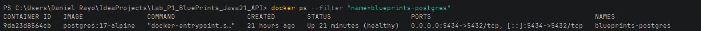
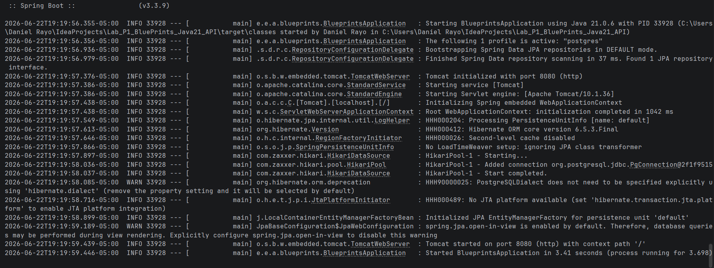
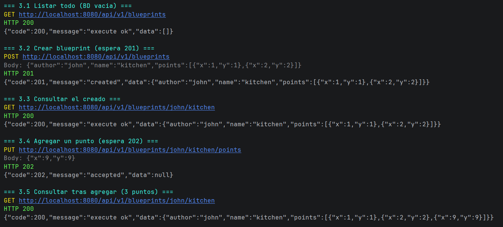
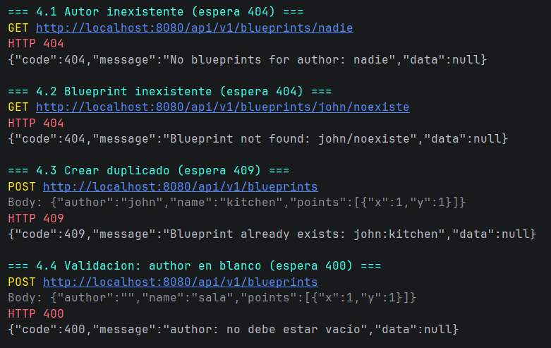
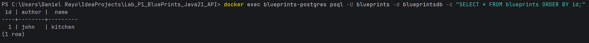
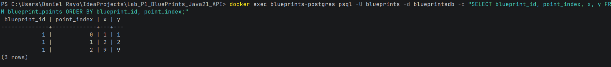

# Evidencias — Actividad 2: Migración a PostgreSQL

Este documento recopila la evidencia de que la API persiste los blueprints en una
base de datos PostgreSQL real (perfil de Spring `postgres`), respetando el contrato
`BlueprintPersistence` y los códigos HTTP correctos.

## 1. Infraestructura: PostgreSQL en Docker

`docker-compose.yml` levanta PostgreSQL 17 exponiendo el puerto **5434** del host
(el 5432 está ocupado por un PostgreSQL local).

```bash
docker compose up -d
docker ps --filter "name=blueprints-postgres"
```

## 2. Arranque de la app con el perfil `postgres`

```powershell
mvn spring-boot:run -Dspring-boot.run.profiles=postgres
```

Al arrancar, Hibernate crea automáticamente el esquema (`ddl-auto=update`):

```sql
create table blueprints (
    id bigint generated by default as identity,
    author varchar(255) not null,
    name varchar(255) not null,
    primary key (id)
)
alter table blueprints add constraint uk_author_name unique (author, name)

create table blueprint_points (...)   -- con FK a blueprints y columna point_index (orden)
```

```
Tomcat started on port 8080 (http)
Started BlueprintsApplication in 3.92 seconds
```

## 3. Prueba de los endpoints (camino feliz)

> Base URL: `http://localhost:8080/api/v1/blueprints`

| Operación | Petición | Respuesta | HTTP |
|-----------|----------|-----------|------|
| Listar todo (BD vacía) | `GET /api/v1/blueprints` | `{"code":200,"message":"execute ok","data":[]}` | 200 |
| Crear blueprint | `POST /api/v1/blueprints` body `{"author":"john","name":"kitchen","points":[{"x":1,"y":1},{"x":2,"y":2}]}` | — | **201** |
| Consultar uno | `GET /api/v1/blueprints/john/kitchen` | `{"code":200,"message":"execute ok","data":{"author":"john","name":"kitchen","points":[{"x":1,"y":1},{"x":2,"y":2}]}}` | 200 |
| Agregar punto | `PUT /api/v1/blueprints/john/kitchen/points` body `{"x":9,"y":9}` | — | **202** |
| Consultar tras agregar | `GET /api/v1/blueprints/john/kitchen` | `...points":[{"x":1,"y":1},{"x":2,"y":2},{"x":9,"y":9}]}` | 200 |

## 4. Prueba de códigos de error

| Caso | Respuesta | HTTP |
|------|-----------|------|
| Autor inexistente | `{"code":404,"message":"No blueprints for author: nadie","data":null}` | **404** |
| Blueprint inexistente | `{"code":404,"message":"Blueprint not found: john/noexiste","data":null}` | **404** |
| Crear duplicado | `{"code":409,"message":"Blueprint already exists: john:kitchen","data":null}` | **409** |
| Validación (author en blanco) | `{"code":400,"message":"author: no debe estar vacío","data":null}` | **400** |

## 5. Evidencia de persistencia en la base de datos

Consultando directamente PostgreSQL (los datos creados por la API quedan persistidos):

```bash
docker exec blueprints-postgres psql -U blueprints -d blueprintsdb \
  -c "SELECT * FROM blueprints ORDER BY id;"
```

```bash
docker exec blueprints-postgres psql -U blueprints -d blueprintsdb \
  -c "SELECT blueprint_id, point_index, x, y FROM blueprint_points ORDER BY blueprint_id, point_index;"
```


Los 3 puntos (los 2 del POST + el agregado por PUT) están almacenados y **ordenados**
mediante `point_index`, confirmando la persistencia real en PostgreSQL.

## 6. Arquitectura aplicada

- El dominio (`Blueprint`, `Point`) **no se modificó**: permanece libre de anotaciones JPA.
- Se añadieron entidades JPA separadas (`BlueprintEntity`, `PointEmbeddable`) y un
  `PostgresBlueprintPersistence` que **traduce entidad ↔ dominio**.
- El cambio de almacenamiento (memoria ↔ PostgreSQL) se controla por **perfiles de Spring**,
  sin tocar controladores ni servicios: misma interfaz `BlueprintPersistence`.
